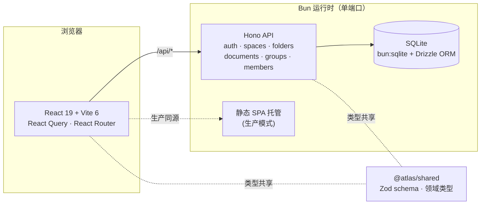
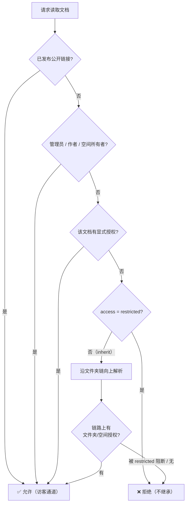

<div align="center">

# Atlas

**自托管的团队知识库与文档协作平台 —— 以细粒度授权为核心的权限引擎**

把 HTML / Markdown 文档组织进「空间 → 文件夹」目录树，用 *grants（授权边）+ 分组能力* 精确控制谁能读、谁能写、谁能对外发布。

<br/>

[](https://bun.sh)
[](https://react.dev)
[](https://www.typescriptlang.org)
[](https://hono.dev)
[](https://orm.drizzle.team)
[](https://biomejs.dev)
[](LICENSE)

</div>

---

## 这是什么

Atlas 是一个 **端到端可自托管** 的文档管理后台：成员把 Markdown 或整页 HTML 上传/撰写为文档，归入按空间与多级文件夹组织的目录树，再通过一套统一的授权模型决定每个人的可见范围与编辑权限，并可一键生成对外公开的分享链接。

整个项目是一个 **Bun workspaces 单仓库**，前后端共享同一套 Zod 领域模型，运行时、包管理、测试器全部由 Bun 一手包办——**不需要 Node.js、不需要 `better-sqlite3` 编译链、不需要 Docker**。

## 核心特性

| 特性 | 说明 |
|---|---|
| **Grants 授权引擎** | `主体(成员/分组) → 目标(空间/文件夹/文档)` 的授权边模型，自动取最高权限合并，文件夹沿继承链解析 |
| **分组 + 能力（A+B 模型）** | 分组既携带全局能力（建空间 / 管成员 / 管分组 / 发布），又承载对目标的授权；成员能力为所在分组的并集 |
| **空间与多级文件夹** | 文档归入空间下的嵌套目录树；`restricted` 文件夹可阻断空间级权限向下穿透 |
| **Markdown / HTML 双格式** | Markdown 内置 KaTeX 公式、Mermaid 流程图、代码高亮、GitHub Alerts、脚注、任务列表、目录；HTML 在沙箱 iframe 中原样呈现 |
| **公开分享链接** | 支持启用 / 到期 / 撤销 / token 轮换 / 访问计数；与站内权限正交，独立的访客通道 |
| **回收站 + 软删除** | 删除进回收站、可恢复、可永久删除，支持到期自动清理 |
| **会话与防护** | `Bun.password` 校验、30 天 HttpOnly Session、双提交 CSRF、登录失败按 IP+邮箱限速、审计日志 |
| **一键生产部署** | 单端口同时托管 SPA + API、纯环境变量配置、dev/prod 数据隔离、内置严格 CSP |

## 架构概览



- **前端** `apps/web` — React 19 + Vite 6 + TypeScript，React Query 管理数据、React Router 落地可刷新 URL。
- **后端** `apps/api` — Hono 路由 + Drizzle ORM + 原生 `bun:sqlite`，所有内容落在单个 SQLite 文件。
- **共享** `packages/shared` — Zod schema 与领域类型，前后端单一事实来源，避免把 `bun:sqlite` 类型拖进浏览器工程。

## 权限模型

Atlas 的权限不是简单的角色枚举，而是一张可组合的授权图。读取一篇文档时的判定链路如下：



| 维度 | 取值 | 含义 |
|---|---|---|
| **全局角色** | `admin` / `member` | admin 拥有一切；member 的能力来自分组 |
| **分组能力** | `createSpace` · `manageMembers` · `manageGroups` · `publish` | 成员有效能力 = 所在分组能力的并集 |
| **授权角色** | `viewer` / `editor` | 主体对目标的读 / 读写权限，合并时取最高 |
| **文档访问模式** | `inherit` / `restricted` | inherit 沿目录树继承；restricted 仅显式授权可达 |

> 个人空间的所有者对自己空间内的全部文档拥有读写权限；公开暴露始终经由独立的 `share_links`，与站内授权解耦。

## 快速开始

> **环境要求：** [Bun](https://bun.sh) ≥ 1.3.14（运行时 + 包管理 + 测试器三合一）。macOS / Linux / WSL2。Windows 原生不支持 `bun:sqlite`，请用 WSL2。

```bash
# 1. 安装依赖（Bun 自动 link workspace）
bun install

# 2. 初始化数据库并灌入示例数据
bun run --filter @atlas/api db:migrate
bun run --filter @atlas/api db:seed

# 3. 启动开发服（会先自动应用已提交迁移）
bun dev
```

前端默认在 `http://localhost:5173`，API 在 `http://localhost:3000`；Vite 会把 `/api/*` 代理到后端，所以前端代码统一调用 `/api/...`。

`db:seed` 会写入一批共用固定密码的 **公开演示账号**，仅用于本地体验权限矩阵，**切勿在生产环境运行**。

## 生产部署

生产模式下 Bun 用 **单端口同时托管编译后的 SPA 与 API**（同源，无需 CORS），配置全部来自环境变量，dev / prod 数据目录自动隔离。

```bash
cp .env.example .env        # 按注释填写：NODE_ENV、PORT、数据目录、首个管理员凭据
bun run build               # 构建所有 workspace
bun run --filter @atlas/api db:migrate
bun run --filter @atlas/api db:create-admin   # 用 .env 中的凭据创建首个管理员
bun run start               # 单端口启动（先迁移，再托管 SPA + API）
```

关键环境变量（完整列表见 [`.env.example`](.env.example)）：

| 变量 | 作用 |
|---|---|
| `NODE_ENV=production` | 启用 Secure Cookie、单端口托管、禁用演示 seed、选用 prod 数据目录 |
| `ATLAS_DATA_DIR` / `DATABASE_URL` | 把 SQLite 数据放到代码目录之外的持久路径（**记得备份这个文件**） |
| `ATLAS_ADMIN_*` | 首个管理员的邮箱 / 姓名 / 密码，仅 `db:create-admin` 使用 |
| `ATLAS_TRUST_PROXY` | 反向代理后置 `1`，登录限速才会读取真实客户端 IP |
| `ATLAS_CSP` | 覆盖内置的严格同源 CSP（默认已含 Google Fonts） |

## 常用脚本

| 命令 | 作用 |
|---|---|
| `bun dev` | 应用迁移后同时启动 web 与 api |
| `bun run build` | 构建所有 workspace |
| `bun run typecheck` | 全量 TypeScript 类型检查 |
| `bun test apps/api/src` | 运行 API 测试 |
| `bun run lint` / `bun run fmt` | Biome 检查 / 格式化 |
| `bun run --filter @atlas/api db:generate` | 改完 schema 后生成迁移 |
| `bun run --filter @atlas/api db:migrate` | 应用已提交迁移 |
| `bun run --filter @atlas/api db:create-admin` | 用环境凭据创建/重置首个管理员 |

## 目录结构

```text
.
├── apps/
│   ├── web/                  前端 (Vite + React 19 + TS)
│   │   └── src/
│   │       ├── views/        Reader / 公开页 / Markdown·HTML 编辑器
│   │       ├── views-admin/  空间 / 文件夹 / 成员 / 分组 / 权限 / 回收站
│   │       ├── markdown/     markdown-it 渲染管线 (KaTeX·Mermaid·高亮)
│   │       ├── api-client.ts fetch 封装 + CSRF header 注入
│   │       └── data-hooks.ts React Query 查询与 mutation
│   └── api/                  后端 (Hono + Drizzle + bun:sqlite)
│       └── src/
│           ├── routes/       auth · spaces · folders · documents · groups · members
│           ├── lib/          grants · permissions · auth · audit · env · html-limits
│           └── db/           schema · client · migrate · seed · create-admin
└── packages/
    └── shared/               共享 Zod schema、领域类型与 HTML/Markdown 元数据工具
```

数据库共 10 张表：`members` · `groups` · `groupMembers` · `sessions` · `spaces` · `folders` · `documents` · `grants` · `shareLinks` · `auditLogs`。

## API 速览

所有前端请求走 `/api` 前缀；非 `GET` 的会话写请求必须带 `X-Atlas-CSRF` header（值取自 `atlas_csrf` cookie）。主要路由分组：

| 分组 | 端点示例 |
|---|---|
| **会话** | `POST /auth/login` · `POST /auth/logout` · `GET /auth/me` · `GET /auth/audit` |
| **空间** | `GET /spaces` · `POST /spaces` · `PATCH/DELETE /spaces/:id` · `PUT /spaces/:id/members` |
| **文件夹** | 在空间下创建 / 移动 / 软删除嵌套文件夹 |
| **文档** | `POST /documents/upload` · `PATCH /documents/:id` · `GET /documents/trash` · `PATCH /documents/:id/share` · `GET /documents/public/:token` |
| **分组** | 分组增删改、能力配置、成员归属、对目标授权 |
| **成员** | `GET/POST /members` · `GET /members/permissions`（权限矩阵） |

## 安全边界

- 密码用 `Bun.password` 校验 bcrypt hash；登录失败统一返回 `401`，不区分邮箱不存在 / 密码错误。
- Session cookie 为 `HttpOnly` + `SameSite=Lax`，30 天有效，生产环境默认带 `Secure`；写请求要求双提交 CSRF token。
- **上传的 HTML 不做服务端清洗**：原样入库（仅 8 MB 大小校验），阅读/预览页用 `sandbox="allow-scripts allow-forms allow-popups"` 的 iframe 隔离。沙箱**不含** `allow-same-origin`，文档脚本拿不到父页 cookie/localStorage——**这个 sandbox 是唯一的隔离边界，切勿移除**。
- 关键写操作写入 `audit_logs`；管理员可清理过期 session 与回收站。

## 路线图

- [ ] **前端 e2e** —— Playwright 覆盖登录 / 上传 / 分享 / 回收站 / 权限切换关键路径
- [ ] **生产级鉴权体验** —— 邮箱验证、邀请成员、找回密码、SSO/OIDC、Session 管理页
- [ ] **HTML 安全加固** —— 资源代理、图片/下载白名单、恶意样本回归集、iframe 权限复核
- [ ] **审计与分享 UI 完整化** —— 审计日志筛选/分页、公开访问统计、noindex 落到公开页

## 许可证

本项目以 [MIT License](LICENSE) 开源。

---

<div align="center">
<sub>使用 Bun · React 19 · Hono · Drizzle 构建 · 不依赖 Node.js / Docker</sub>
</div>
